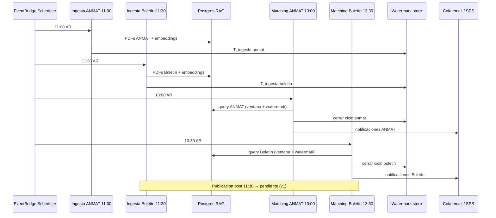

# AL-02 — Cobertura temporal de procesamiento de Alertas

**Versión:** 0.1 (borrador)  
**Fecha:** 2026-05-19  
**Estado:** Requerimiento / especificación funcional  
**Relacionado:** [AL-01](../.cursor/rules/AL-01-alertas-dias-no-laborables.mdc) (días no laborables)

---

## 1. Objetivo

Garantizar que las **Alertas** reflejen **solo novedades** del período aún no procesado ni notificado, con **cobertura completa** de publicaciones del Boletín Oficial y fuentes asociadas (p. ej. ANMAT), sin pérdidas por:

- ventanas horarias fijas,
- publicaciones tardías después del corte del día, o
- acumulación de fines de semana y feriados.

**Resultado esperado:** alertas **consistentes y acumulativas únicamente sobre lo pendiente**; el usuario no recibe re-notificaciones de disposiciones ya cubiertas.

---

## 2. Alcance

| Incluye | No incluye (salvo decisión explícita) |
|--------|----------------------------------------|
| Ingesta de documentos (SFN Boletín / ANMAT → S3 → embeddings → Postgres) | Cambio del algoritmo de matching semántico |
| Ventana temporal de “qué documentos entran al matching” | Rediseño del esquema de tablas de alertas |
| Scheduling de ingesta (11:00 ANMAT / 11:30 Boletín) y matching (13:00 ANMAT / 13:30 Boletín) | Contenido de templates de email (ver EM-01) |
| Recuperación de publicaciones posteriores al corte | Alertas en sábado/domingo como día de envío (AL-01) |
| Casuística lunes + fin de semana | |

**Zona horaria de referencia:** `America/Argentina/Buenos_Aires` (UTC-3, sin DST).

---

## 3. Definiciones

| Término | Definición |
|--------|------------|
| **Día civil** | Fecha calendario `YYYY-MM-DD` en TZ Argentina. |
| **Día hábil** | Lunes a viernes no feriado (feriados: lista configurable; v1 puede reutilizar solo lun–vie como AL-01). |
| **Día de boletín** | Fecha de la edición del documento en el Boletín (`created_at` / partición S3 `YYYYMMDD`), no la hora de procesamiento. |
| **Ventana de procesamiento** | Intervalo `[T_anterior, T_actual)` entre dos ejecuciones exitosas del pipeline de ingesta + marcador de corte. |
| **Novedad del día** | Documento cuya fecha de publicación/edición es el **día civil en curso** (día hábil de ejecución) y cuyo registro **no** fue incluido en un ciclo de alertas ya **cerrado** para ese documento. |
| **Pendiente de franja anterior** | Documento con fecha de edición **≤ último día hábil relevante** pero **publicado o disponible** después del cierre de la última ventana (p. ej. viernes después de las 13:00, o sábado/domingo antes del lunes). |
| **Corte de ingesta** | Marca de tiempo `T_ingesta` por corpus: ANMAT ~**11:00**, Boletín ~**11:30** (fin de descarga/embeddings antes del matching de la tarde). |
| **Corte de alertas** | Marca de tiempo `T_alertas` por corpus: ANMAT ~**13:00**, Boletín ~**13:30** (fin del matching/notificación de ese ciclo). |
| **Watermark** | Estado persistido por corpus/tenant: última ventana cerrada, documentos ya notificados, último `T_ingesta` / `T_alertas` exitoso. |

---

## 4. Requerimiento funcional (RF)

### RF-01 — Solo novedades del período no cubierto

Las alertas generadas en un ciclo deben basarse en documentos/chunks que:

1. Pertenezcan al conjunto **novedad del día** ∪ **pendiente de franja anterior**, y  
2. **No** hayan sido incluidos en un ciclo de alertas ya **cerrado y notificado** (según watermark).

El matching (`alerts_semantic_matches` / batch ECS) debe filtrar por `created_at` (partición del documento) **y** por estado de procesamiento/notificación, no solo por “hoy”.

### RF-02 — Ingesta matutina (ANMAT 11:00 / Boletín 11:30)

**Todos los días hábiles**, el sistema ejecuta la **ingesta de documentos** (SFN → S3 → embeddings → Postgres) en dos corridas escalonadas (Argentina):

| Hora (AR) | Corpus | Mecanismo |
|-----------|--------|-----------|
| **11:00** | ANMAT | SFN `rag-anmat-to-s3writer-prod` vía `rag-prod-sched-sfn-runner` (`corpus=anmat`) |
| **11:30** | Boletín | SFN `Alerts-BoletinOficialSyncronizer` vía `rag-prod-sched-sfn-runner` (`corpus=boletin`) |

**Ventana de fechas a ingerir en cada corrida (día hábil D):**

- **D** (día en curso), y  
- **Pendientes** desde el cierre de la ventana anterior (ver RF-04).

**Embeddings:** tras cada PDF en S3, completar indexación con **concurrencia limitada** (evitar throttling Bedrock) antes del matching de la tarde.

### RF-03 — Matching vespertino (ANMAT 13:00 / Boletín 13:30)

**Todos los días hábiles**, ejecutar **matching semántico + generación de alertas** (`alerts_semantic_matches` en ECS) **después** de la ingesta matutina del mismo corpus:

| Hora (AR) | Corpus | Mecanismo |
|-----------|--------|-----------|
| **13:00** | ANMAT | ECS `rag-batch-alerts-anmat-prod` |
| **13:30** | Boletín | ECS `rag-batch-alerts-boletin-prod` |

**Precondición:** la ingesta de las **11:00 / 11:30** del mismo corpus debe haber finalizado con éxito **o** el matching opera solo sobre el subconjunto ya indexado, registrando documentos “ingesta pendiente” para RF-05.

**Separación ingesta ↔ matching:** ~2 h entre bloque matutino y vespertino para absorber embeddings y evitar competir con Bedrock en el mismo minuto.

### RF-04 — Pendientes de la franja anterior

En cada ciclo del día hábil **D**, además de las novedades de **D**, incluir documentos **pendientes** definidos como:

```
pendiente(doc) :=
  fecha_edicion(doc) ∈ días_relevantes(D)
  AND disponible_en_sistema(doc) > T_cierre_ventana_anterior
  AND doc no notificado en ciclo cerrado
```

Donde `días_relevantes(D)` se calcula según RF-06 (ej. lunes → viernes + sábado + domingo + lunes).

**Ejemplo (viernes):** ingesta 11:30 del viernes cubre edición viernes; si algo se publica a las 15:00 con fecha viernes, debe entrar en pendiente y procesarse en RF-05 o en la primera corrida del lunes.

### RF-05 — Publicaciones posteriores al corte de ingesta

El sistema debe **detectar y notificar** documentos que aparezcan **después del corte de ingesta** (~11:00 ANMAT / ~11:30 Boletín) mediante al menos uno de:

| Estrategia | Descripción | Prioridad sugerida |
|-----------|-------------|-------------------|
| **A. Corrida complementaria** | Segunda ingesta + matching en horario fijo (p. ej. 18:00 / 18:30) solo si hay fuente con actividad tardía. | Media |
| **B. Polling ligero** | Consulta periódica (cada N minutos hasta hora tope) del origen o de S3/Postgres por `last_modified`. | Media |
| **C. Watermark + próximo día hábil** | Lo publicado después de 13:00 queda en pendiente y se incluye en la ventana del **siguiente día hábil** (mínimo viable). | **Alta (v1)** |

**v1 mínima:** implementar **C** con watermark explícito; documentar que alertas “tardías” del mismo día civil pueden llegar en el **primer ciclo del día hábil siguiente** salvo que se active A o B.

### RF-06 — Fines de semana y lunes

| Día de ejecución | Ingesta / alertas | Conjunto de fechas de edición a considerar |
|------------------|-------------------|---------------------------------------------|
| Mar–vie | Sí (ingesta 11:00/11:30 · matching 13:00/13:30) | D + pendientes desde cierre anterior |
| Sáb–dom | **No** ejecución programada (AL-01) | — |
| **Lunes** | Sí | **Lunes D** + pendientes: **viernes** (post 13:00), **sábado**, **domingo**, y cualquier pendiente no cerrado |

**Regla lunes (ejemplo del requerimiento):**

1. Mapear novedades del **lunes**.  
2. Incluir disposiciones del **viernes** publicadas después de la última ventana de procesamiento del viernes.  
3. Incluir documentos con fecha de edición **sábado y domingo** (si el boletín publica en fin de semana).  
4. No re-notificar lo ya incluido en un ciclo **cerrado**.

**Alineación con código actual:** `scheduled_boletin_anmat_sfn` usa ventana `[último día hábil previo, hoy]` (AL-01). La spec **extiende** esa lógica con **watermark horario** y **conjunto explícito fin de semana** para matching de alertas, no solo para ingesta SFN.

### RF-07 — Cobertura continua

- Ninguna disposición elegible debe quedar **sin revisar** ni **sin notificar** si generó match según reglas de negocio.  
- Toda omisión por fallo técnico (SFN, embeddings, batch) debe quedar **registrada** y **reintentada** en el siguiente ciclo hábil sin duplicar notificaciones ya enviadas.

### RF-08 — Días no laborables (AL-01)

- Schedulers con guard `weekday() < 5`; log `SKIP: ejecución en día no laborable`.  
- Feriados nacionales: **fase 2** (lista en configuración); v1 solo fin de semana.

---

## 5. Flujo objetivo (día hábil)



---

## 6. Modelo de watermark (propuesta técnica)

Persistir por **corpus** (`boletin`, `anmat`) y **entorno**:

```json
{
  "corpus": "boletin",
  "last_ingesta_completed_at": "2026-05-19T13:05:00-03:00",
  "last_alerts_completed_at": "2026-05-19T13:42:00-03:00",
  "last_closed_window_end": "2026-05-19T13:00:00-03:00",
  "notified_document_keys": ["20260519/primera/...", "..."],
  "pending_edition_dates": ["20260516", "20260517"]
}
```

**Almacenamiento candidato:** DynamoDB (tabla operativa existente), Aurora (tabla `alert_processing_state`), o S3 manifest versionado. Decisión en diseño técnico.

**Idempotencia:** clave de notificación = `hash(tenant_id, alert_id, document_id, chunk_id?, cycle_id)`.

---

## 7. Cronograma objetivo (prod, TZ Argentina)

Todos los horarios en **`America/Argentina/Buenos_Aires`**, **lun–vie** (AL-01).

| Hora (AR) | Fase | Corpus | Recurso / componente | Cron objetivo (Scheduler) |
|-----------|------|--------|----------------------|---------------------------|
| **11:00** | Ingesta | ANMAT | `rag-prod-anmat-daily` → Lambda `rag-prod-sched-sfn-runner` → SFN ANMAT | `cron(0 11 ? * MON-FRI *)` |
| **11:30** | Ingesta | Boletín | `rag-prod-boletin-daily` → SFN `Alerts-BoletinOficialSyncronizer` | `cron(30 11 ? * MON-FRI *)` |
| **13:00** | Matching | ANMAT | ECS `rag-batch-alerts-anmat-prod` → `alerts_semantic_matches.py` | `cron(0 13 ? * MON-FRI *)` |
| **13:30** | Matching | Boletín | ECS `rag-batch-alerts-boletin-prod` | `cron(30 13 ? * MON-FRI *)` |
| *(v2)* **18:00 / 18:30** | Ciclo complementario tardío | Ambos | Mismo stack, flag `complementary=true` | A definir |

**Regla:** entre ingesta y matching del **mismo corpus** hay **~2 h** (margen para embeddings). Entre ANMAT y Boletín en ingesta hay **30 min**; en matching igual.

### Gap vs hoy (prod 913, snapshot 2026-05-19)

| Componente | Hoy (desplegado) | Objetivo spec | Acción |
|------------|------------------|---------------|--------|
| **ANMAT ingesta** (SFN) | **09:30 AR** (`cron(30 9 …)`, TZ AR) | **11:00 AR** | Mover `rag-prod-anmat-daily` a `cron(0 11 ? * MON-FRI *)` |
| **Boletín ingesta** (SFN) | **11:30 AR** (`cron(30 11 …)`, TZ AR) | **11:30 AR** | OK |
| **ANMAT matching** (ECS batch) | **10:30 AR** (`cron(30 13 …)` **UTC**) | **13:00 AR** | Batch: TZ AR + `cron(0 13 ? * MON-FRI *)` |
| **Boletín matching** (ECS batch) | **11:00 AR** (`cron(0 14 …)` **UTC**) | **13:30 AR** | Batch: TZ AR + `cron(30 13 ? * MON-FRI *)` |
| **Watermark horario** | No existe (SFN solo ventana 2 fechas) | Por corpus + corte 11:xx / 13:xx | RF-04–07, §6 |
| **Embeddings** | Paralelo SQS (throttling/deadlock) | Concurrencia baja 11:00–12:30 | `maxConcurrency` Lambda + serialización recuperación |
| **ARN SFN Boletín** (scheduler) | Corregido a SM sin `-prod` | Idem | OK desde fix 2026-05-19 |
| **Tenant Boletín** | `tenant_boletin` en scheduler | Idem | OK |

**Nota infra:** `infra/batch-alerts-semantic-matches/variables.tf` documenta mal la conversión ART↔UTC en los defaults; los schedules ECS deben usar **`schedule_expression_timezone = America/Argentina/Buenos_Aires`** (hoy el batch corre en **UTC**).

---

## 8. Criterios de aceptación

### CA-01 — Horarios
- [ ] Schedules desplegados (TZ Argentina, lun–vie): ingesta ANMAT **11:00**, Boletín **11:30**; matching ANMAT **13:00**, Boletín **13:30**.
- [ ] El matching de cada corpus no inicia antes de que su ingesta matutina haya terminado o se registre degradación controlada.

### CA-02 — Ventana y pendientes
- [ ] Un documento publicado viernes 15:30 (después del corte) aparece en alertas del **lunes** y no se pierde.
- [ ] Documentos sábado/domingo (si existen en origen) se incluyen en el ciclo del **lunes**.
- [ ] Documentos ya notificados en un ciclo cerrado **no** generan segunda notificación por el mismo match.

### CA-03 — Día en curso
- [ ] Las alertas del día hábil D priorizan novedades con fecha de edición D, más pendientes definidos en RF-04.

### CA-04 — AL-01
- [ ] Cero ejecuciones de generación/envío de alertas en sábado y domingo.
- [ ] Log `SKIP` en schedulers si se disparan por error en fin de semana.

### CA-05 — Observabilidad
- [ ] Dashboard o logs con: `T_ingesta`, `T_alertas`, docs ingeridos, docs matcheados, docs notificados, docs pendientes.
- [ ] Alerta operativa si ingesta matutina falla y el matching vespertino del mismo corpus se omite o corre vacío sin aviso.

### CA-06 — Prueba de regresión (escenario lunes)
Dado viernes con corrida 13:00/13:30 exitosa y simulación de PDF nuevo viernes 17:00 + sábado + domingo + lunes 10:00:  
Entonces el lunes 13:00 (ANMAT) y 13:30 (Boletín) producen alertas para todos los pendientes no notificados y para lunes, sin duplicar los del viernes ya notificados.

---

## 9. Riesgos y mitigaciones

| Riesgo | Mitigación |
|--------|------------|
| Throttling Bedrock en ingesta paralela | `EMBED_BATCH_SIZE` bajo; `reservedConcurrentExecutions` en Lambda embeddings; invocación serializada en recuperación |
| SFN “SUCCEEDED” sin PDFs (fin de semana) | Distinguir éxito técnico vs `pdf_links.total > 0` en métricas |
| Doble schedule (11:30 actual + 13:00 nuevo) | Deshabilitar horario viejo al migrar |
| ANMAT sin filtro por hora de publicación | Watermark por `filter_yyyymm` + fecha de norma en matching |

---

## 10. Fases de implementación sugeridas

| Fase | Entregable |
|------|------------|
| **F1** | Alinear crons: ingesta ANMAT 11:00, Boletín 11:30 (OK); batch ANMAT 13:00 y Boletín 13:30 **TZ AR**; dependencia ingesta → matching por corpus |
| **F2** | Tabla/manifest watermark + filtro en `alerts_semantic_matches` por “no notificado” |
| **F3** | Lógica lunes ampliada (vie+sáb+dom) unificada ingesta + matching |
| **F4** | Ciclo complementario post-13:00 o polling (RF-05 A/B) |

---

## 11. Referencias en repo

| Área | Ubicación |
|------|-----------|
| Scheduler Boletín/ANMAT | `terraform/modules/scheduled_boletin_anmat_sfn/` |
| Batch matching alertas | `scripts/alerts_semantic_matches.py`, `infra/batch-alerts-semantic-matches/` |
| Días no laborables | `.cursor/rules/AL-01-alertas-dias-no-laborables.mdc` |
| SFN Boletín | `Alerts-BoletinOficialSyncronizer`, `scripts/boletin_syncronizer_invoker.py` |
| Fin de semana en bolinks | `apps/rag_lmbd_bolinks/index.py` (`weekday() in (5,6)`) |

---

## 12. Preguntas abiertas (para producto)

1. ¿Feriados nacionales argentinos bloquean ingesta/alertas como el fin de semana?  
2. ¿El ciclo complementario tardío (18:00) es obligatorio en v1 o aceptamos pendiente al día siguiente?  
3. ¿Ciclo complementario 18:00 aplica a ambos corpus o solo Boletín?  
4. ¿“Última franja cubierta” se define por hora de publicación en el sitio oficial o por `ObjectCreated` en S3?
